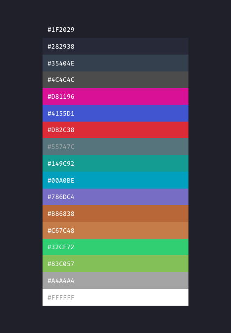

# Glip Glops
Glip Glops is a color theme. It’s like *Xcode*’s **Civic** and **Dusk**  themes had a baby and it was raised by all the other languages you love to code in.

So basically it’s supposed to run pretty much everywhere, bringing you the immense joy of having a unified look throughout your everyday tools.

`TODO vision`

## Palette


## Installation
`TODO`
### Via script
`TODO`
### Manually
`TODO`
#### Xcode
Xcode doesn't provide a seamless way to add new themes, so you'll need to copy these [contents](themes/Xcode) into
```
~/Library/Developer/Xcode/UserData/FontAndColorThemes/
```
An easy way to get there is to open a Finder window and use the command `⌘ + ⇧ + G` and paste the path there.

## Contributing
`TODO`

## Screenshots
`TODO`

## Acknowledgements
`TODO mention repo inspiration in Cocoapods Moya`

## License
Glip Glops is released under an MIT license. See [LICENSE](https://github.com/afonsograca/Glip-Glops/blob/master/LICENSE) for more information.